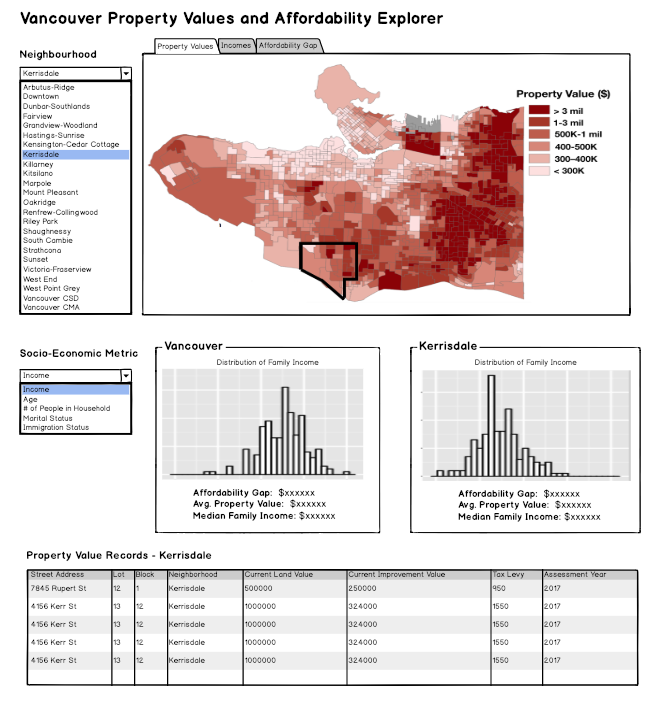

# Vancouver Property Value Analysis
> App deployed at: https://ian-flores.shinyapps.io/vancouver_tax/

## Authors

| Carrie Cheung | Ian Flores Siaca |
| ------------- | ---------------- |
| [@carrieklc](https://github.com/carrieklc) | [@ian-flores](https://github.com/ian-flores) |

## Write-Ups

- [Milestone 3](docs/milestone3_writeup.md)
- [Application Writeup](docs/app_writeup.md)
- [Proposal](docs/proposal.md)

## Overview

With home prices in Vancouver at record highs over recent years, many are concerned about housing affordability, especially [the gap](https://globalnews.ca/news/4444324/metro-vancouver-home-prices-incomes/) between property values and the income of people currently living in Vancouver. If we can compare property values of homes in different neighbourhoods of Vancouver and the socio-economic background of people who reside in those areas, we can identify neighbourhoods where the affordability gap is particularly severe. To do this, we propose building a data visualization application that allows city lawmakers to visually explore property value and socio-economic data geographically mapped to Vancouver neighbourhoods. Our app will show the distribution of property values across the city and allow users to filter on a specific neighbourhood in order to compare property values with various socio-economic statistics for that neighbourhood.

## App Design

