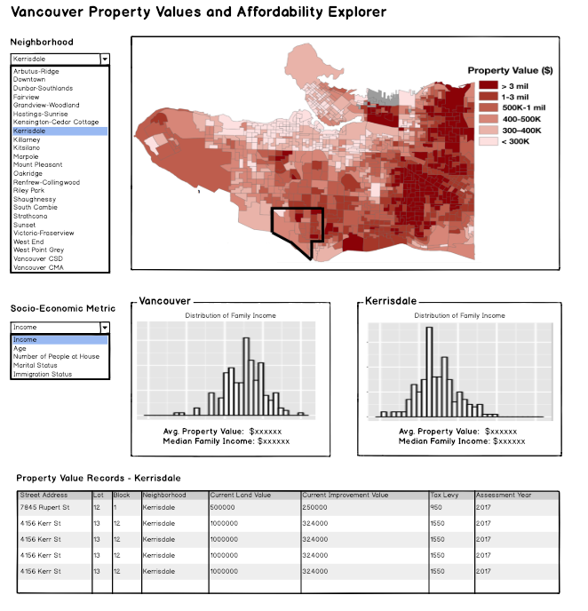

## Vancouver Property Value Analysis

### 1: Overview

With home prices in Vancouver at record highs over recent years, many are concerned about housing affordability, especially [the gap](https://globalnews.ca/news/4444324/metro-vancouver-home-prices-incomes/) between property values and the income of people currently living in Vancouver. If we can compare property values of homes in different neighbourhoods of Vancouver and the socio-economic background of people who reside in those areas, we can identify neighbourhoods where the affordability gap is particularly severe. To do this, we propose building a data visualization application that allows city lawmakers to visually explore property value and socio-economic data geographically mapped to Vancouver neighbourhoods. Our app will show the distribution of property values across the city and allow users to filter on a specific neighbourhood in order to compare property values with various socio-economic statistics for that neighbourhood.

### 2: Description of data

For this project, we will be using two datasets provided by the City of Vancouver in their Open Data Catalogue. The first of these datasets is the [Property Tax Report Data](https://data.vancouver.ca/datacatalogue/propertyTax.htm) for the year 2018 and we can calculate the total home price by adding the land value plus the improvement value. (Property value = Land value + Improvement value) We will visualize the home price in the first dataset by plotting a choropleth map displaying a summary statistic about the home value per neighbourhood. Moving to the second dataset, we will be using the [Census Local Area Profile for 2016](https://data.vancouver.ca/datacatalogue/censusLocalAreaProfiles2016.htm), which includes data for each neighbourhood about the age, income, number of people living per house and the proportions per immigrant status of the people living there.

### 3: Usage Scenario and Tasks

The Ministry of Municipal Affairs and Housing of British Columbia is interested in understanding what are the factors
driving the gap between income of people and the prices of their homes to enable public policy solutions. They want to be
able to [identify] areas that need faster intervention because the gap is higher than in the rest of the city. However, they
want to be able to [compare] neighbourhoods and [explain] why in certain areas it might be worse than others. When they
login, they will see a map of Vancouver with its 22 neighbourhoods displaying a summary statistic about the property value
for each neighbourhood. If they wish to explore more in-depth a specific neighbourhood, they will be able to select the one
of interest from a dropdown menu. Once the user has choosen their neighbourhood, they can go ahead and [explore] how the
socio-economic variables are distributed in that neighbourhood and how it compares to Vancouver in general.  To the moment,
they hypothesize that neighbourhoods with lower incomes might be the ones with a bigger gap.

### 4: Description of App and Initial Sketch

The main page of the app features a map of Vancouver that is colour coded based on property values, allowing users to see which areas of the city have higher property values on average. Tabs above the map provide options to instead colour code the map based on the average income of people living in an area, or based on the size of an "affordabiliy gap" in that area. An affordability gap is a rough approximation of the difference between:

* The dollar amount a homeowner needs to pay per year on average over 30 years to equal the average property value of a home, and:
* The average annual income of people living in that area.

The larger the affordability gap in a neighbourhood, the more a user might want to further explore that neighbourhood in detail. To explore a neighbourhood, users can select a neighbourhood from a dropdown list. A distribution and/or summary statistic of dataset factors (property value, a variable related to socio-economic of people who live in the area such as income or age, etc.) will be shown for that neighbourhood. Users can choose the specific socio-economic variable to show by making a selection in a different dropdown list.

If more details about individual properties are needed, there is a section in the app that shows more granular information about each Vancouver property, including the specific address and lot number.

_Note: This mockup uses a modified version of the choropleth graphic from this [blog](http://blogs.ubc.ca/katerynabaranovasgis/cartography/). The histograms are also clipped from the [ggplot2 tutorials](http://www.sthda.com/english/wiki/ggplot2-histogram-plot-quick-start-guide-r-software-and-data-visualization)._
